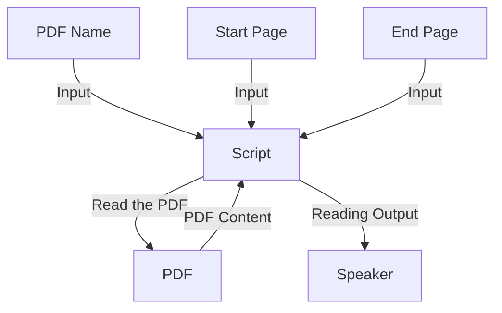

# Audiobook

This project is a Python script that allows you to make audiobook with any PDF. Simply enter the PDF Name/PATH, page number where it'll start reading, and the the page number where it'll stop. Thats it! The script will read the PDF!

## How to use?
The program will prompt you to input the `PDF Name`, `Enter the Page Number where it'll start reading`, `Enter the Page Number where it'll end reading (0 for Last Page)`. After entering all the information, the program will start reading from that page!

## How it works?

## Software Requirements
- [Python 3.9.5](https://www.python.org/downloads/release/python-395/)
- An IDE for editing code:
   - [Pycharm Community Edition](https://www.jetbrains.com/pycharm/download)
   - [Visual Studio Code](https://code.visualstudio.com/download)
   - [Spyder](https://www.spyder-ide.org/#section-download)
   - others...
   
## Module Requirement
| Module | Version | `pip` Command |
| :--: | :-----: | :---: |
| PyPDF2 | 3.0.1 | `pip install PyPDF2==3.0.1` |
| pttsx3 | 2.90 | `pip install pyttsx3==2.90` |

Thank you! You've read all the instructions here!

By the way, a Star to this Repository would be awesome!

> 09 March, 2023/Tahsin
